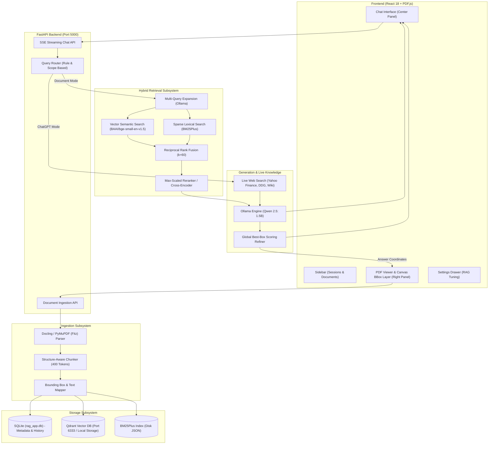
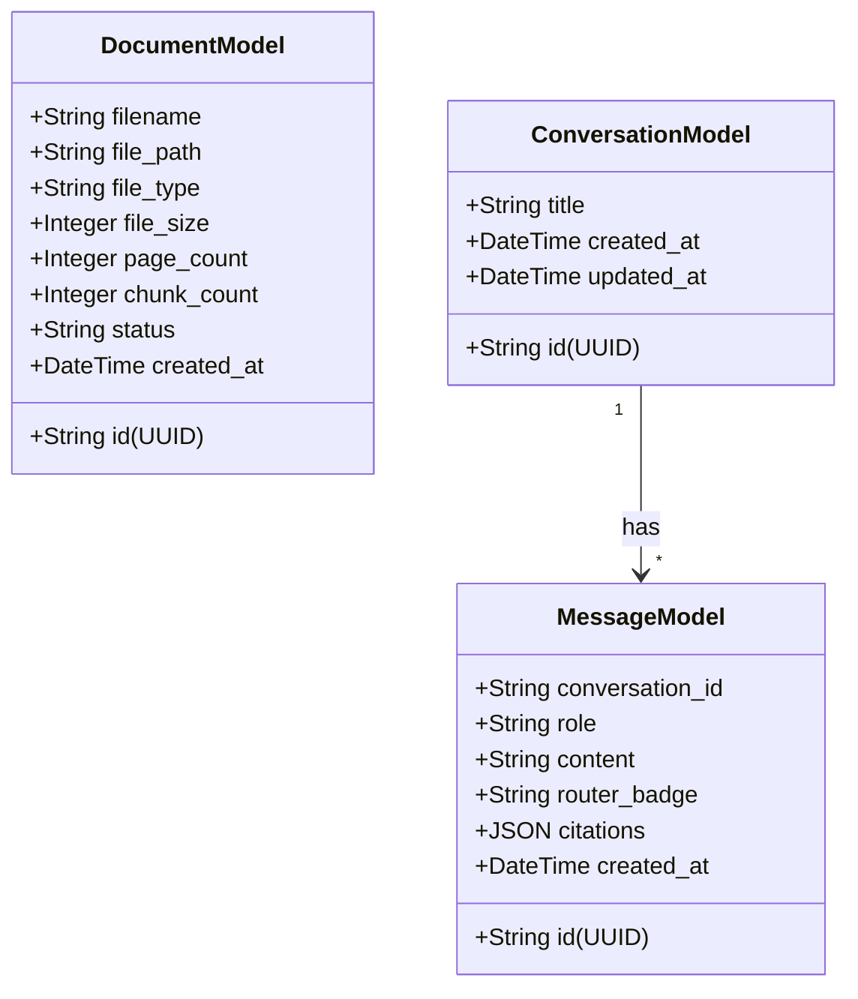

# System Architecture & Technical Specifications
## DocuChat AI — Hybrid RAG & Live Knowledge Platform

---

## 1. High-Level Architecture Overview



---

## 2. Ingestion Subsystem

### 2.1 Parsing Engine (`parsers/docling_parser.py`)
- **Primary Parser:** IBM Docling containerized service (`http://localhost:5001`).
- **Resilient Fallback:** Local `pymupdf` (Fitz) engine if Docling is offline.
- **Data Model:** Each parsed item produces a `ParsedElement`:
  ```python
  class ParsedElement:
      text: str
      page: int
      bboxes: List[Dict[str, Any]] # Contains: x0, y0, x1, y1, text, page_width, page_height, coord_origin
      heading_path: List[str]
      elem_type: str               # "paragraph", "heading", "table"
      metadata: Dict[str, Any]
  ```

### 2.2 Structural Chunking (`chunking/structure_chunker.py`)
- Groups elements until token budget is reached ($\approx 400$ target tokens, 50 token overlap).
- Preserves markdown headers, section paths, and table row groupings.
- Accumulates element-level bounding boxes and attaches the exact sentence/phrase `text` to each bounding box.

---

## 3. Storage Layer



1. **SQLite (`rag_app.db` via SQLAlchemy AsyncSession):**
   - Stores documents, conversations, and chat history.
2. **Qdrant Vector Database (`doc_chunks` collection):**
   - Dense 384-dimensional vector representations computed via `BAAI/bge-small-en-v1.5` (FastEmbed ONNX runtime).
   - Embedded storage fallback at `./data/qdrant_storage` ensures operation even without Docker.
3. **BM25Plus Index (`./data/bm25/<doc_id>.json`):**
   - JSON-persisted tokenized inverted indices for exact lexical lookup.

---

## 4. Retrieval & Fusion Pipeline

### 4.1 Multi-Query Expansion (`llm/rewriter.py`)
Incoming queries are expanded into 2–3 sub-queries using conversational history to resolve ambiguous pronouns (e.g., *"what is his percentage"* $\rightarrow$ *"what is the candidate intermediate percentage"*).

### 4.2 Hybrid Parallel Search
```python
# Concurrently execute dense and sparse search
v_hits = vector_store.search(query_vector=qvec, doc_ids=doc_ids, limit=30)
b_hits = bm25_index.search(query=q, doc_ids=doc_ids, limit=30)
```

### 4.3 Reciprocal Rank Fusion (RRF)
Combines rankings across all multi-query vector and BM25 results:
$$RRF(d) = \sum_{m \in M} \frac{1}{k + r_m(d)} \quad (k = 60)$$

### 4.4 Max-Scaled Reranking (`retrieval/reranker.py`)
To prevent the common RAG flaw where min-max normalization forces the second-best chunk to $0.0$, DocuChat uses max-scaling:
$$\text{norm\_score} = \frac{\text{raw\_score}}{\max(\text{raw\_scores})}$$
This preserves all chunks that exceed `score_threshold` (0.25).

---

## 5. Grounded Generation & Precision Highlighting

### 5.1 Prompt Construction (`llm/generator.py`)
- Up to 3,500 characters per chunk are passed into context.
- The prompt instructs the model to provide exhaustive lists (e.g. all technical skill categories) and cite inline sources using `[1]`.

### 5.2 Global Best-Box Selection (`refine_citations_for_answer`)
When the LLM finishes generating the answer:
1. Candidate bounding boxes across all retrieved citations are scored against the generated answer tokens.
2. Numeric values, percentages, and skill keywords receive weighted boosts:
   $$\text{Score}(B) = \sum_{w \in \text{Ans}} \mathbb{I}(w \in B) \times 3 + \sum_{n \in \text{Digits}} \mathbb{I}(n \in B) \times 6$$
3. The single highest-scoring bounding box is assigned to the citation. All non-relevant boxes are pruned.

---

## 6. Real-Time Live Web Search Subsystem (`retrieval/web_search.py`)

When the user queries without active documents or asks off-topic real-world questions:
- **Financial Markets:** Queries Yahoo Finance (`query1.finance.yahoo.com`) for real-time prices, price deltas, and percentage moves (e.g. AAPL, NVDA, TSLA).
- **Movies & Entertainment:** Queries DuckDuckGo HTML/Lite for current theater listings, releases, and reviews.
- **Sports & Politics:** Queries Wikipedia API & DuckDuckGo for live standings, leaders, and election results.
- **Zero API Keys:** Operates 100% free using standard library HTTP clients with bot-safe headers.

---

## 7. Frontend Architecture (`frontend/src/App.jsx`)
- **Framework:** React 18 with CSS custom property design system.
- **PDF Viewer:** `pdfjs-dist` rendering directly onto an HTML5 `<canvas>`.
- **Overlay Coordinates:**
  $$\text{top} = y_0 \times \frac{\text{canvas.height}}{\text{page\_height}}, \quad \text{left} = x_0 \times \frac{\text{canvas.width}}{\text{page\_width}}$$
  Supports both `TOPLEFT` and `BOTTOMLEFT` origin transformations.
- **Streaming Consumer:** Server-Sent Events (SSE) reader parsing `meta`, `token`, `citations`, and `done` events.
