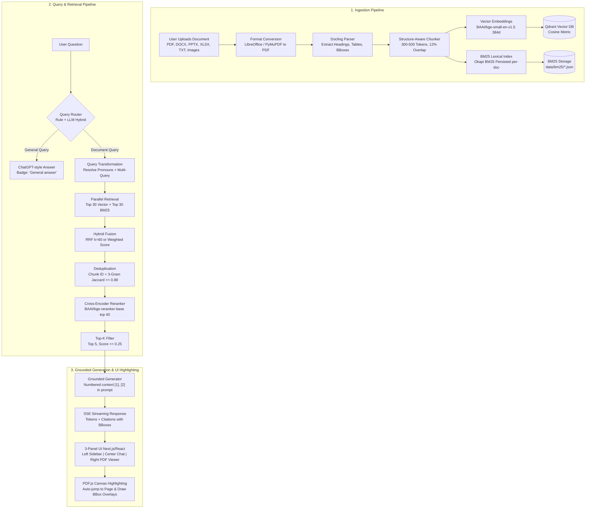

# DocuChat AI • Production Document Intelligence & Grounded Chat

An enterprise-ready, production-grade Document RAG (Retrieval-Augmented Generation) system built for deep document understanding, precise bounding-box provenance highlighting, hybrid lexical/vector search, and grounded LLM generation powered by **Ollama (Qwen 2.5: 1.5B)** and **Qdrant**.

---

## 🏛️ End-to-End Architecture



---

## ⚙️ Selected Defaults & Configurations

Every parameter is fully configurable via `.env` or the frontend Settings Drawer:

| Component | Default Value | Description / Rationale |
| :--- | :--- | :--- |
| **LLM Provider** | Ollama Native (`http://localhost:11434`) | Local, private, zero-latency inference |
| **LLM Model** | `qwen2.5:1.5b` | Kept as requested; optimized with compact prompts |
| **LLM Temperature** | `0.1` (Document) / `0.7` (General) | Strict grounding for docs; creative for general chat |
| **Embedding Model** | `BAAI/bge-small-en-v1.5` | SOTA compact retrieval embedding (384 dimensions) |
| **Vector DB** | Qdrant (`http://localhost:6333`) | Collection: `doc_chunks` with Cosine distance |
| **BM25 Index** | Okapi BM25 (`./data/bm25`) | Per-document persisted JSON index |
| **Chunking** | Target: 400 tokens (300–500) | 12% overlap (~50 tokens); respects headings & tables |
| **Query Router** | `hybrid` | Rule-based heuristics with LLM JSON fallback |
| **Retrieval Top-K** | `30` Vector + `30` BM25 | Candidates gathered per generated sub-query |
| **Hybrid Fusion** | `rrf` (Reciprocal Rank Fusion) | $k = 60$; optional weighted score fusion ($\alpha = 0.5$) |
| **Deduplication** | `0.88` Jaccard similarity | Deduplicates identical chunks and near-duplicate text |
| **Reranker** | `BAAI/bge-reranker-base` | Rescores top 40 candidates with sigmoid probabilities |
| **Final Top-K** | `5` (configurable 1–10) | Top passages fed into context window |
| **Score Threshold** | `0.25` | Discards low-relevance candidates |
| **Database** | SQLite (`rag_app.db`) / PostgreSQL | Asynchronous SQLAlchemy ORM for sessions & docs |

---

## 🧠 Small Model Optimization Strategy (`qwen2.5:1.5b`)

Small parameter models (1.5B) require careful prompt engineering:
1. **Ultra-Short Prompts:** System instructions are kept compact (< 60 tokens) to leave maximum context for document snippets.
2. **Strict JSON Output & Regex Fallback:** The query router and rewriter request JSON format (`{"route": "document"}`), backed by a robust regex parser that extracts decisions if JSON syntax is imperfect.
3. **Rule-Based Routing Option:** Configurable via `ROUTER_MODE=rule` in `.env` or the UI to bypass LLM classification completely for instant, 0ms routing.
4. **Context Budgeting:** Text snippets are truncated to 900 characters per passage, ensuring the combined prompt remains well within the model's 32k context window without attention dilution.

---

## 🚀 Getting Started

### 1. Prerequisites
- **Python 3.10+**
- **Node.js 18+** & **npm**
- **Ollama** installed and running:
  ```bash
  ollama pull qwen2.5:1.5b
  ```
- **Qdrant** (via Docker or local binary):
  ```bash
  docker run -p 6333:6333 -v qdrant_data:/qdrant/storage qdrant/qdrant:latest
  ```

### 2. Local Backend Setup
```bash
cd backend
pip install -r requirements.txt
python main.py
# Backend starts at http://localhost:5000
# API docs available at http://localhost:5000/docs
```

### 3. Local Frontend Setup
```bash
cd frontend
npm install
npm start
# Frontend starts at http://localhost:3000
```

---

## 🐳 Docker Compose Deployment

To run the entire ecosystem (Backend, Frontend, Qdrant, Ollama, Docling, PostgreSQL, Redis) with a single command:

```bash
docker compose up --build -d
```

To enable **NVIDIA GPU acceleration** for Ollama, uncomment the `deploy.resources.reservations` block inside [docker-compose.yml](file:///c:/Users/AMD/OneDrive/Desktop/Git%20rag/RAG-Based-ChatBot-Main/docker-compose.yml#L60-L68).

---

## 🧪 Testing & Evaluation

### Run Unit Tests
```bash
python backend/tests/test_retrieval.py
```
*Tests structure-aware chunking, RRF fusion, weighted fusion, and Jaccard deduplication.*

### Run Retrieval Benchmark (Hit Rate@K / MRR)
```bash
python backend/eval/retrieval_eval.py
```
Output:
```
============================================================
      DocuChat Retrieval Benchmark: Hit Rate@K & MRR     
============================================================
Top-1  | Hit Rate@1:  50.00% | MRR@1: 0.5000
Top-3  | Hit Rate@3: 100.00% | MRR@3: 0.7083
Top-5  | Hit Rate@5: 100.00% | MRR@5: 0.7083
Top-10 | Hit Rate@10: 100.00% | MRR@10: 0.7083
============================================================
```

---

## 📡 REST API Reference

| Method | Endpoint | Description |
| :--- | :--- | :--- |
| `POST` | `/api/documents` | Upload document (PDF, DOCX, XLSX, TXT, Images) with background processing |
| `GET` | `/api/documents` | List all documents and ingestion statuses |
| `GET` | `/api/documents/{id}/file` | Stream viewable PDF file for the PDF.js viewer |
| `DELETE` | `/api/documents/{id}` | Delete document, vectors from Qdrant, and BM25 index |
| `POST` | `/api/chat` | Server-Sent Events (SSE) chat stream with citations and router badges |
| `GET` | `/api/conversations` | List conversation sessions |
| `POST` | `/api/conversations` | Create new conversation session |
| `GET` | `/api/conversations/{id}` | Get full conversation message history |
| `DELETE` | `/api/conversations/{id}` | Delete conversation and its messages |
| `GET` | `/health` | Health check and configuration status |
