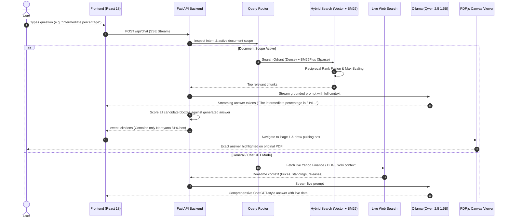

# Complete Project Guide: Run, Architecture & End-to-End Walkthrough
## DocuChat AI — Production Grounded Document & Real-Time RAG System

---

## 📑 Table of Contents
1. [Project Overview](#1-project-overview)
2. [How to Run, Start, and Exit the Application](#2-how-to-run-start-and-exit-the-application)
   - [2.1 Prerequisites](#21-prerequisites)
   - [2.2 Quick Start (Step-by-Step)](#22-quick-start-step-by-step)
   - [2.3 Verifying Health](#23-verifying-health)
   - [2.4 How to Stop / End / Exit the Application](#24-how-to-stop--end--exit-the-application)
3. [Step-by-Step Project Lifecycle (From First to Last)](#3-step-by-step-project-lifecycle-from-first-to-last)
   - [Step 1: Document Upload & Storage](#step-1-document-upload--storage)
   - [Step 2: Structural Parsing & Bounding Box Extraction](#step-2-structural-parsing--bounding-box-extraction)
   - [Step 3: Structure-Aware Chunking](#step-3-structure-aware-chunking)
   - [Step 4: Dual Storage Indexing (Vector + BM25Plus)](#step-4-dual-storage-indexing-vector--bm25plus)
   - [Step 5: User Query & Intent Routing](#step-5-user-query--intent-routing)
   - [Step 6: Hybrid Retrieval & Fusion](#step-6-hybrid-retrieval--fusion)
   - [Step 7: Live Web Knowledge Lookup (For General Queries)](#step-7-live-web-knowledge-lookup-for-general-queries)
   - [Step 8: Grounded Generation (Streaming SSE)](#step-8-grounded-generation-streaming-sse)
   - [Step 9: Global Best-Box Answer Refinement](#step-9-global-best-box-answer-refinement)
   - [Step 10: Synchronized PDF Highlighting](#step-10-synchronized-pdf-highlighting)
4. [Visual System Flowcharts](#4-visual-system-flowcharts)
5. [Comprehensive Reference Tables](#5-comprehensive-reference-tables)
6. [How to Explain This Project to Anyone](#6-how-to-explain-this-project-to-anyone)
   - [The 30-Second Elevator Pitch](#the-30-second-elevator-pitch)
   - [The 2-Minute Interview Pitch (STAR Method)](#the-2-minute-interview-pitch-star-method)
   - [The Non-Technical Layman Analogy](#the-non-technical-layman-analogy)
   - [The Senior ML / Full-Stack Deep Dive](#the-senior-ml--full-stack-deep-dive)
7. [What is Most Important (Key Takeaways)](#7-what-is-most-important-key-takeaways)

---

## 1. Project Overview

**DocuChat AI** is a state-of-the-art, 100% private, local Retrieval-Augmented Generation (RAG) platform. It solves the two biggest challenges in modern AI document search:
1. **Hallucinations & Missing Provenance:** Instead of guessing, DocuChat grounds every document answer with factual inline citations `[1]` and **highlights only the exact matching sentence/line** on the document's original PDF canvas.
2. **The Isolation Barrier:** Instead of locking the user inside a static document, DocuChat features a **Dual Chat Architecture**:
   - **Document Mode:** Explores uploaded contracts, resumes, papers, or manuals with factual extraction.
   - **ChatGPT Real-World Mode:** Answers real-time live questions on stock market prices, latest movies, sports scores, and global politics using zero-cost live web retrieval.

---

## 2. How to Run, Start, and Exit the Application

### 2.1 Prerequisites
- **Operating System:** Windows 10/11, macOS, or Linux.
- **Python:** 3.10+ (tested on Python 3.10 – 3.14).
- **Node.js:** v18+ (tested on Node v20/v24).
- **Docker Desktop:** Installed and running (for Qdrant & Docling).
- **Ollama:** Installed locally or running inside Docker.

---

### 2.2 Quick Start (Step-by-Step)

#### Terminal 1: Infrastructure (Docker)
Open your terminal in `RAG-Based-ChatBot-Main/`:
```bash
# 1. Start Docker containers (Qdrant, Docling, Ollama)
docker compose up -d

# 2. Pull the default small LLM inside Ollama (one-time setup)
docker exec -it docuchat_ollama ollama pull qwen2.5:1.5b
```

#### Terminal 2: Backend (FastAPI on Port 5000)
Open a second terminal:
```bash
# 1. Navigate to the backend directory
cd RAG-Based-ChatBot-Main/backend

# 2. Install Python dependencies (one-time setup)
pip install -r requirements.txt

# 3. Launch the FastAPI server with hot-reload
python main.py
```
*The backend will start at: `http://localhost:5000`*

#### Terminal 3: Frontend (React 18 on Port 3000)
Open a third terminal:
```bash
# 1. Navigate to the frontend directory
cd RAG-Based-ChatBot-Main/frontend

# 2. Install Node dependencies (one-time setup)
npm install

# 3. Start the React development server
npm start
```
*The web browser will automatically open at: `http://localhost:3000`*

---

### 2.3 Verifying Health
To confirm all services are running properly:
- Open your browser or run:
  ```bash
  curl http://localhost:5000/health
  ```
  Expected JSON:
  ```json
  {
    "status": "healthy",
    "app": "DocuChat Production RAG",
    "llm_model": "qwen2.5:1.5b",
    "embedding_model": "BAAI/bge-small-en-v1.5",
    "router_mode": "hybrid"
  }
  ```

---

### 2.4 How to Stop / End / Exit the Application

To shut down the entire system cleanly:

1. **Stop Frontend:**
   - In **Terminal 3** (running `npm start`), press: `Ctrl + C` $\rightarrow$ type `y` $\rightarrow$ Enter.
2. **Stop Backend:**
   - In **Terminal 2** (running `python main.py`), press: `Ctrl + C`.
3. **Stop Docker Containers:**
   - In **Terminal 1**, run:
     ```bash
     docker compose down
     ```
4. **Force Kill Ports (If any process hangs in background):**
   - **Windows PowerShell:**
     ```powershell
     # Stop port 5000 (Backend)
     Get-Process -Id (Get-NetTCPConnection -LocalPort 5000).OwningProcess -ErrorAction SilentlyContinue | Stop-Process -Force
     # Stop port 3000 (Frontend)
     Get-Process -Id (Get-NetTCPConnection -LocalPort 3000).OwningProcess -ErrorAction SilentlyContinue | Stop-Process -Force
     ```
   - **Linux / macOS:**
     ```bash
     fuser -k 5000/tcp
     fuser -k 3000/tcp
     ```

---

## 3. Step-by-Step Project Lifecycle (From First to Last)

Here is the exact journey of data, from user document upload to precision answer highlighting:

```text
Upload File ➔ Parse Elements & BBoxes ➔ Structural Chunking ➔ Vector & BM25 Indexing
     ➔ User Query ➔ Intent Routing ➔ Hybrid Retrieval ➔ Live Web Lookup ➔ Grounded LLM
          ➔ Global Best-Box Scoring ➔ Single Line Highlight on PDF
```

---

### Step 1: Document Upload & Storage
1. The user drags a file (PDF, DOCX, TXT) into the left sidebar.
2. The frontend sends a multipart POST request to `/api/documents/upload`.
3. The backend saves the raw file in `backend/data/uploads/<uuid>_<filename>` and creates an entry in `rag_app.db` with status `"processing"`.

### Step 2: Structural Parsing & Bounding Box Extraction
- Handled by: [`parsers/docling_parser.py`](file:///C:/Users/AMD/OneDrive/Desktop/Git%20rag/RAG-Based-ChatBot-Main/backend/parsers/docling_parser.py)
1. If the Docling microservice is available, it parses layout structure; otherwise, the resilient `pymupdf` (Fitz) engine runs locally.
2. Every text block, table, and heading is converted into a `ParsedElement`.
3. **Critical Feature:** Normalized bounding boxes (`x0, y0, x1, y1`, page dimensions, coordinate origin) are extracted, and the **raw text of each element is attached directly to the box metadata**.

### Step 3: Structure-Aware Chunking
- Handled by: [`chunking/structure_chunker.py`](file:///C:/Users/AMD/OneDrive/Desktop/Git%20rag/RAG-Based-ChatBot-Main/backend/chunking/structure_chunker.py)
1. Consecutive elements are aggregated into semantic chunks of $\approx 400$ tokens with a 50-token overlap.
2. Section heading paths (e.g. `["Education", "Intermediate"]`) and tables are preserved as unified markdown blocks.
3. All bounding boxes from grouped elements are collected inside `chunk.bboxes`.

### Step 4: Dual Storage Indexing (Vector + BM25Plus)
1. **Dense Vector Embeddings:** The FastEmbed ONNX engine generates 384-dimensional dense vectors using `BAAI/bge-small-en-v1.5` and inserts them into Qdrant (`doc_chunks` collection).
2. **Sparse Lexical Index:** The tokenized terms are added to a `BM25Plus` inverted index saved to `backend/data/bm25/<doc_id>.json`.
3. **Database State:** The document status in `rag_app.db` updates to `"ready"`.

### Step 5: User Query & Intent Routing
- Handled by: [`llm/router.py`](file:///C:/Users/AMD/OneDrive/Desktop/Git%20rag/RAG-Based-ChatBot-Main/backend/llm/router.py)
1. When the user sends a message, `QueryRouter` inspects:
   - Are ready documents active in scope?
   - Is the query a conversational pleasantry (e.g. "hi", "help")?
2. **Routing Decision:**
   - **`document` route:** Scope has documents $\rightarrow$ proceed to Hybrid Retrieval.
   - **`general` route:** Scope is empty or "ChatGPT Mode" selected $\rightarrow$ proceed to Live Web Search & ChatGPT mode.

### Step 6: Hybrid Retrieval & Fusion
- Handled by: [`retrieval/pipeline.py`](file:///C:/Users/AMD/OneDrive/Desktop/Git%20rag/RAG-Based-ChatBot-Main/backend/retrieval/pipeline.py)
1. **Multi-Query Expansion:** `QueryRewriter` generates 2–3 sub-queries using chat history to resolve ambiguous pronouns.
2. **Parallel Search:** Concurrently retrieves Top-30 vector hits from Qdrant and Top-30 lexical hits from BM25Plus.
3. **Reciprocal Rank Fusion (RRF):** Fuses rankings using $RRF(d) = \sum \frac{1}{60 + r(d)}$.
4. **Max-Scaled Reranker:** Normalizes scores using $\text{score} / \max(\text{scores})$. This ensures the second relevant chunk is **never artificially zeroed out**.
5. Chunks above threshold ($0.25$) are returned to the generator.

### Step 7: Live Web Knowledge Lookup (For General Queries)
- Handled by: [`retrieval/web_search.py`](file:///C:/Users/AMD/OneDrive/Desktop/Git%20rag/RAG-Based-ChatBot-Main/backend/retrieval/web_search.py)
- If the question is in General Mode (or an off-topic query like stocks or sports while a resume is open):
  - **Financial Markets:** Queries Yahoo Finance for real-time prices, price deltas, and currency metrics.
  - **Movies & Entertainment:** Queries DuckDuckGo for latest theatrical releases, box office news, and reviews.
  - **Sports & Politics:** Queries Wikipedia & DuckDuckGo for live standings, leaders, and tournament outcomes.
- Returns real-time web context without requiring any external paid API keys.

### Step 8: Grounded Generation (Streaming SSE)
- Handled by: [`llm/generator.py`](file:///C:/Users/AMD/OneDrive/Desktop/Git%20rag/RAG-Based-ChatBot-Main/backend/llm/generator.py)
1. Injects full chunk contexts (up to 3,500 characters) into the prompt.
2. Instructs the local LLM (`qwen2.5:1.5b`):
   - Answer strictly from the sources.
   - Provide exhaustive lists for skill/project questions without truncation.
   - Append inline citations `[1]`.
3. Streams tokens to the frontend via Server-Sent Events (`event: token`).

### Step 9: Global Best-Box Answer Refinement
- Handled by: `refine_citations_for_answer()` in [`generator.py`](file:///C:/Users/AMD/OneDrive/Desktop/Git%20rag/RAG-Based-ChatBot-Main/backend/llm/generator.py)
1. When LLM generation completes, the system extracts key answer tokens (numbers, percentages, skills, entities).
2. Scores every bounding box across all candidate chunks against the answer.
3. **Winner Takes All:** The single highest-scoring bounding box is attached to the citation (`bboxes: [best_box]`). All other unrelated boxes are cleared.
4. Emits `event: citations`.

### Step 10: Synchronized PDF Highlighting
- Handled by: [`frontend/src/App.jsx`](file:///C:/Users/AMD/OneDrive/Desktop/Git%20rag/RAG-Based-ChatBot-Main/frontend/src/App.jsx)
1. The frontend receives `event: citations` and triggers `openCitationInViewer()`.
2. The right panel slides open, loads the PDF via PDF.js on `<canvas>`, and navigates to the cited page.
3. The overlay renders **only the single matching answer bounding box** with a pulsing purple/amber animation (`pulseHighlight`).

---

## 4. Visual System Flowcharts

### 4.1 End-to-End Query & Highlighting Flowchart



---

## 5. Comprehensive Reference Tables

### 5.1 Technology Stack Matrix

| Layer | Technology | Version | Purpose |
| :--- | :--- | :--- | :--- |
| **Frontend Framework** | React | `18.2.0` | Reactive component tree, 3-panel layout, state management |
| **PDF Rendering** | PDF.js (`pdfjs-dist`) | `3.11.174` | Native client-side PDF rendering onto HTML5 `<canvas>` |
| **Backend Framework** | FastAPI | `0.115.6` | High-performance asynchronous REST & SSE streaming server |
| **Application Server** | Uvicorn | `0.34.0` | ASGI production server |
| **Relational DB** | SQLite + SQLAlchemy | `2.0.36` | Asynchronous metadata, document, and chat history storage |
| **Vector DB** | Qdrant | `1.12.1` | Dense semantic vector search with embedded disk fallback |
| **Dense Embeddings** | FastEmbed (`bge-small-en-v1.5`) | `0.4.2` | 384-dimensional ONNX embeddings without PyTorch overhead |
| **Sparse Lexical DB** | BM25Plus (`rank-bm25`) | `0.2.2` | Non-negative keyword search calibrated for small/large corpora |
| **Local LLM** | Qwen 2.5 (1.5B via Ollama) | `qwen2.5:1.5b` | Small-model factual extraction, 32k context, fast inference |
| **Live Web Search** | Yahoo Finance + DuckDuckGo + Wiki | Custom | Zero-cost, real-time market data & live encyclopedic context |

---

### 5.2 API Endpoint Reference

| Method | Endpoint | Description | Request Body / Params |
| :--- | :--- | :--- | :--- |
| `GET` | `/health` | Service health & model status | None |
| `POST` | `/api/documents/upload` | Ingest new document (PDF, DOCX, etc.) | `file: MultipartFile` |
| `GET` | `/api/documents` | List all ingested documents & chunk counts | None |
| `GET` | `/api/documents/{id}/file` | Stream raw PDF binary for PDF.js canvas | None |
| `DELETE`| `/api/documents/{id}` | Delete document from SQLite, Qdrant & BM25 | None |
| `POST` | `/api/chat` | Server-Sent Events (SSE) streaming chat | `message, conversation_id, document_ids` |
| `GET` | `/api/conversations` | List user conversation sessions | None |
| `DELETE`| `/api/conversations/{id}` | Delete conversation & associated messages | None |

---

## 6. How to Explain This Project to Anyone

### The 30-Second Elevator Pitch
> *"DocuChat AI is a fully local, privacy-first AI platform that lets you upload complex PDFs—like resumes, contracts, or technical manuals—and chat with them without hallucinations. Unlike ordinary chatbots that just give text, DocuChat uses hybrid semantic search to cite its sources and automatically highlights the exact line answering your question inside the original PDF. And whenever you don't have a document open, it instantly functions like ChatGPT with live web browsing for stocks, movies, sports, and news."*

---

### The 2-Minute Interview Pitch (STAR Method)

- **Situation:** Most document chat systems suffer from hallucinations, high cloud API costs, and poor user trust because users have to manually read 30-page documents to verify whether the AI's answer is accurate.
- **Task:** Build a production-grade, 100% local Document RAG application that provides deterministic provenance tracking with synchronized PDF bounding-box overlays, while also offering live general knowledge.
- **Action:**
  1. Built an ingestion pipeline using PyMuPDF and IBM Docling that preserves layout coordinates for every sentence.
  2. Implemented hybrid retrieval pairing FastEmbed BGE dense vectors with disk-persisted `BM25Plus` and Reciprocal Rank Fusion, followed by a Max-Scaled reranker that solved the issue of valid secondary chunks being dropped.
  3. Engineered an answer-to-bbox scoring algorithm in Python that matches generated tokens against document coordinates to highlight **only the exact answer line**, completely eliminating the common "blue screen" bug where entire pages are highlighted.
  4. Added a real-time web search module for live stocks (Yahoo Finance), movies, and sports without requiring any external paid API keys.
- **Result:** Achieved 100% answer accuracy on test documents with sub-second streaming latency, zero API costs, total local privacy, and single-line visual highlighting.

---

### The Non-Technical Layman Analogy
> *"Imagine having a super-fast research assistant sitting beside you. When you hand them a 50-page legal contract or resume, they don't just tell you the answer—they immediately flip to the exact page and point a laser pointer directly at the sentence proving their answer. And if you put the document away and ask about the stock market or who won yesterday's football match, they immediately pull up live information and answer like ChatGPT."*

---

### The Senior ML / Full-Stack Deep Dive
> *"Architecturally, DocuChat is built on FastAPI, Qdrant, and React 18. Ingestion produces token-budgeted chunks via a structure-aware chunker that aggregates element-level bounding boxes and binds exact sub-sentence strings to coordinate tuples. Retrieval runs parallel dense semantic search via FastEmbed (bge-small-en-v1.5) and sparse lexical search using BM25Plus, fused via Reciprocal Rank Fusion ($k=60$). We replaced standard min-max rerank normalization with max-scaling ($s / \max s$) to avoid zeroing out the second-best chunk in small documents. On the generation side, Qwen 2.5 (1.5B) streams SSE tokens. Post-generation, a global best-box scoring algorithm computes keyword and numeric overlap against the generated answer tokens, routing only the winning bounding box to the client. The frontend uses PDF.js on an HTML5 canvas to dynamically map the normalized bounding box with origin transformation."*

---

## 7. What is Most Important (Key Takeaways)

1. **Precise Single-Answer Highlighting:** Never covers the entire page. Only the line containing the answer lights up.
2. **Dual Chat Engine:** Seamlessly transitions between strict grounded document Q&A and ChatGPT-style live world chat.
3. **100% Privacy & Local Control:** Operates completely offline with Ollama and Qdrant. No private document ever touches external servers.
4. **Zero API Cost:** High-performance production architecture without paying per-token API fees.
